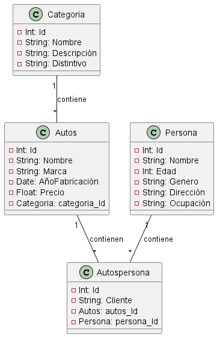

# Parcial Sistema de registro de Concesionario.

### Necesidad: Se tiene un concesionario donde se quiere desarrollar un sistema que permita llevar el registro de la siguiente infomación; Categoría de carros que lleve un `Id`, `nombre categoria`, `descripcón` y `distintivo`.Autos con `Id`, `nombre`, `marca`, `año de fabricación`, `precio` y `ref: Categoria de carros`. AutosPersona `Id`, `cliente`, `ref: Autos`, `ref: Persona`. Persona `Id`, `nombre`, `edad`, `genero`, `dirección` y `ocupación`. En el cual se tiene una relación de un Auto con su respectiva Categoria de carros y una relación de AutosPersona con Autos y Persona.  

#### Análisis: Definición de requerimientos. 

* Categoria de carros {Id, nombre, descripción, distintivo}
* Autos{Id, nombre, marca, año de fabricación, precio, ref:categoria de carros}
* AutosPersona {Id, cliente, ref:Autos, ref:persona}
* Persona {Id, nombre, edad, genero, direccion y ocupación}

1. RF1: Realizar la CRUD de categoria de carros, donde se requiere la siguiente estructura de la entidad : `categorria de carros {Id, nombre, descripción, distintivo}`.
- No puede existir un auto con el mismo Id
2. RF2: Realizar la CRUD de Autos que lleve la siguiente estructura: `Autos{Id, nombre, marca, año de fabricación, precio, ref:categoria de carros}`. 
3. RF3: Realizar la CRUD de AutosPersona con la siguiente estructura: `AutosPersona {Id, cliente, ref:Autos, ref:persona}`.
4. RF4: Realizar la CRUD de Persona con la siguiente estructura: `Persona {Id, nombre, edad, genero, direccion y ocupación}`.

#### Diseñar Base de datos
`Catagoria`

|Id|    Nombre     |                       Descripción                   |              Distintivo                      |
|--|---------------|-----------------------------------------------------|----------------------------------------------|
|1 |Todo Terreno   |Diseñados para cualquier tipo de terreno             |Es un auto muy atractivo para nuevas aventuras.
|2 |Sedan Ejecutivo|Diseñados para ofrecer lujo y alto rendimiento.      |Es un auto que aporta lujo y exclusividad.     
|3 |Deportivos     |Diseñados para ofrecer la máxima emoción al volante. |Autos de alta potencia y rendimiento.

`Autos`

|Id|         Nombre       |    Marca     | Año fabricación |    Precio   | Categoria  Id|
|--|----------------------|--------------|-----------------|-------------|--------------|
|1 |Toyota Land Cruiser   |Land Cruiser  |      1960       | USD46.300   |      1       |
|2 |Mercedes-Benz Clase E |Mercedes-Benz |      1993       | USD 9,795   |      2       |
|3 |Porsche 911           |Porsche       |      1963       | USD 335.100 |      3       |

`Persona`

|Id|     Nombre   | Edad | Genero |  Dirección | Ocupación | 
|--|--------------|------|--------|------------|-----------|
|1 | Camila Perez |  26  |   F    |Cr 7 15-35  |  Pediatra |
|2 | Oscar Cortes |  29  |   M    |Cll 13 8-27 | Contador  |
|3 | Maria Mendes |  35  |   F    |Cll 8 30-127| Empresaria|

`AutosPersona`

|Id|   Cliente | Autos Id | Persona Id |
|--|-----------|----------|------------|
|1 | Cliente 1 |     1    |     3      |
|2 | Cliente 2 |     2    |     2      |
|3 | Cliente 3 |     3    |     1      |

>Ver

*Script de la base de datos

     DROP DATABASE IF EXISTS Concesionario;

     CREATE DATABASE Concesionario;
     
     USE Concesionario; 

     CREATE table Categoria (
        Id INT NOT NULL PRIMARY KEY AUTO_INCREMENT,
        Nombre VARCHAR (50) NOT NULL,
        Descripción VARCHAR (50) NOT NULL,
        Distintivo VARCHAR (50) NOT NULL
     );

     CREATE table Autos(
        Id INT NOT NULL PRIMARY KEY AUTO_INCREMENT,
        Nombre VARCHAR (50) NOT NULL,
        Marca VARCHAR (50) NOT NULL,
        AñoFabricación Date NOT NULL,
        Precio float NOT NULL,
        categoria_Id INT NOT NULL,
        FOREING KEY (categoria_Id) REFERENCES Categoria(Id)
     );

     CREATE table Persona(
        Id INT NOT NULL PRIMARY KEY AUTO_INCREMENT,
        Nombre VARCHAR(50) NOT NULL,
        Edad INT NOT NULL,
        Genero VARCHAR(50) NOT NULL,
        Dirección VARCHAR(50) NOT NULL,
        Ocupación VARCHAR(50) NOT NULL
     );

     CREATE table AutosPersona(
        Id INT NOT NULL PRIMARY KEY AUTO_INCREMENT,
        Cliente VARCHAR(50) NOT NULL,
        autos_Id INT NOT NULL,
        persona_Id INT NOT NULL,
        FOREING KEY (autos_Id) REFERENCES Autos(Id)
        FOREING KEY (persona_Id) REFERENCES Persona(Id)
     );

   
    
